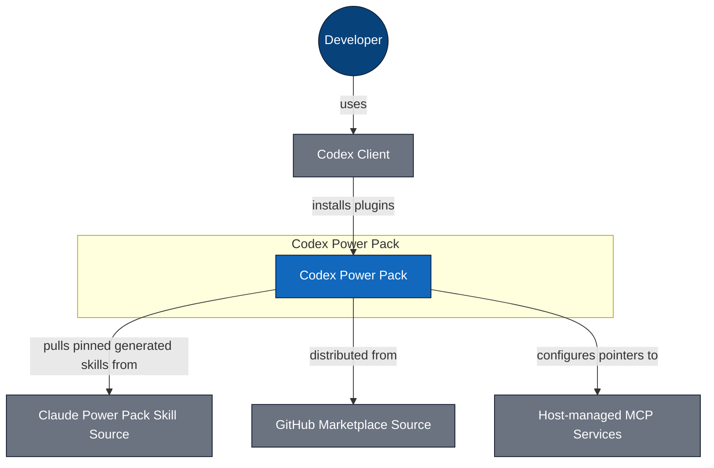
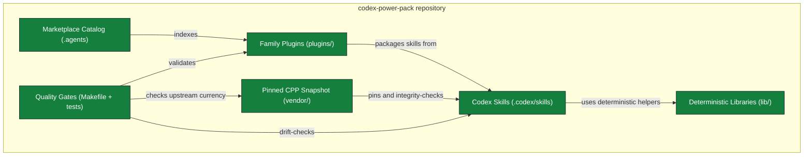
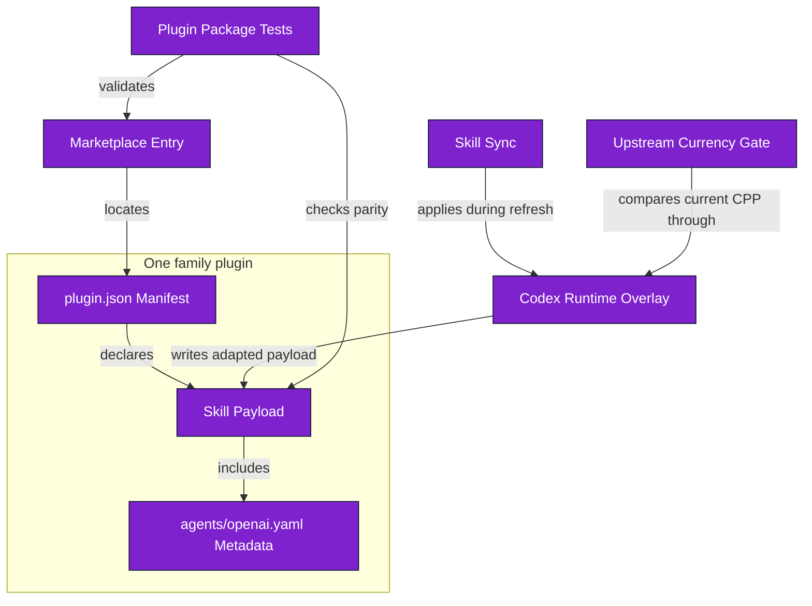
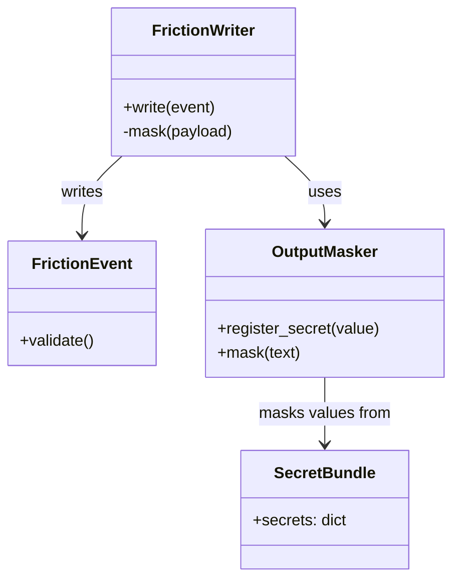

# C4 Architecture - Codex Power Pack

## L1 System Context

_L1 - 6 nodes, 5 edges - [`c4-l1-context.mmd`](c4-l1-context.mmd)_

## L2 Containers

_L2 - 6 nodes, 7 edges - [`c4-l2-container.mmd`](c4-l2-container.mmd)_

## L3 Skill Vendoring and Plugin Distribution

_L3 - 8 nodes, 8 edges - [`c4-l3-plugin-distribution.mmd`](c4-l3-plugin-distribution.mmd)_

## L4 Security and Telemetry Code

_L4 - 4 nodes, 3 edges - [`c4-l4-security-runtime.mmd`](c4-l4-security-runtime.mmd)_

_Generated 2026-07-19T10:19:13Z_
