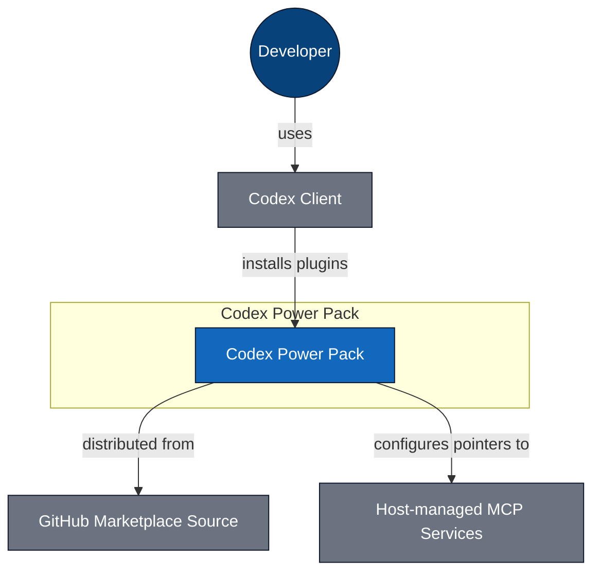
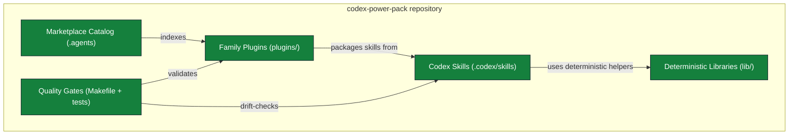
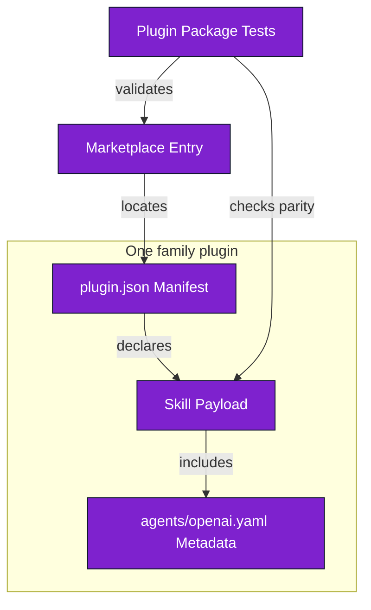
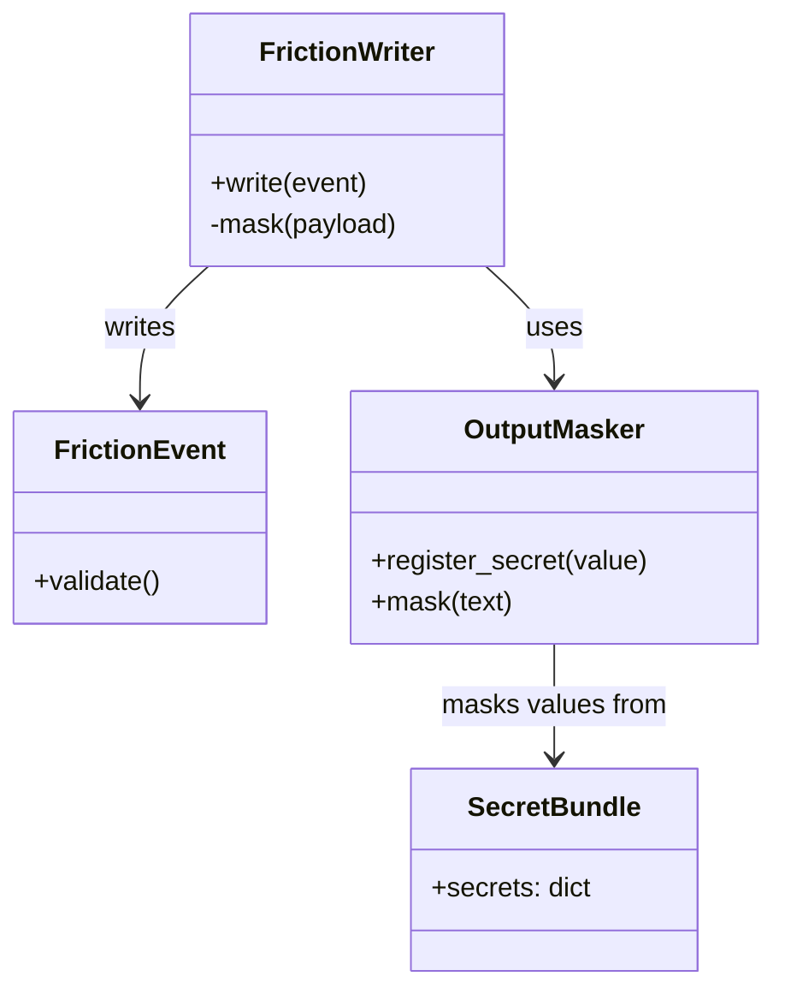

# C4 Architecture - Codex Power Pack

## L1 System Context

_L1 - 5 nodes, 4 edges - [`c4-l1-context.mmd`](c4-l1-context.mmd)_

## L2 Containers

_L2 - 5 nodes, 5 edges - [`c4-l2-container.mmd`](c4-l2-container.mmd)_

## L3 Plugin Distribution Components

_L3 - 5 nodes, 5 edges - [`c4-l3-plugin-distribution.mmd`](c4-l3-plugin-distribution.mmd)_

## L4 Security and Telemetry Code

_L4 - 4 nodes, 3 edges - [`c4-l4-security-runtime.mmd`](c4-l4-security-runtime.mmd)_

_Generated 2026-07-10T00:00:00Z_
