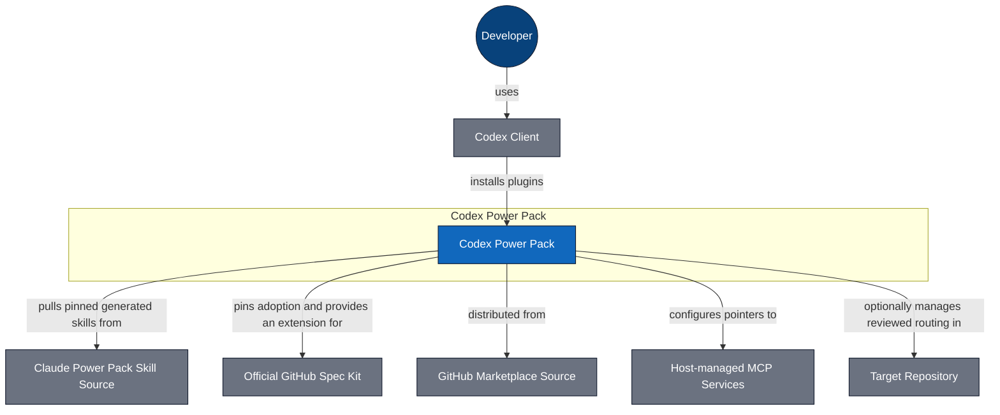
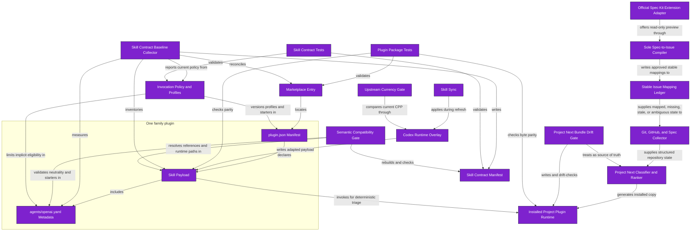
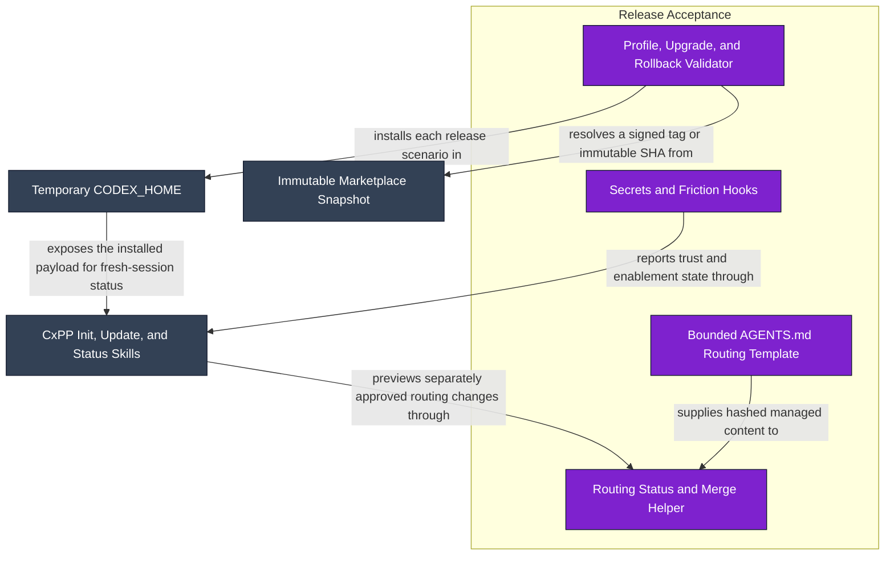
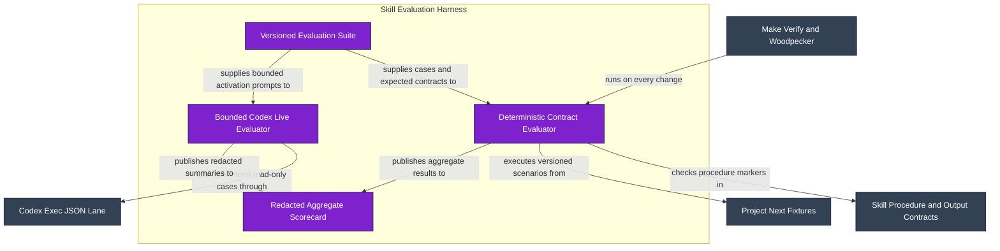
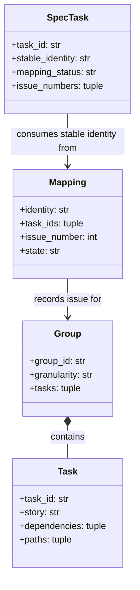
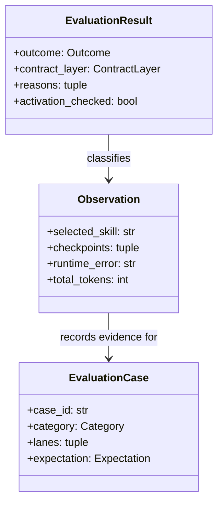

# C4 Architecture - Codex Power Pack

## L1 System Context

_L1 - 8 nodes, 7 edges - [`c4-l1-context.mmd`](c4-l1-context.mmd)_

```mermaid
flowchart TB
  subgraph cxpp_boundary["Codex Power Pack"]
    cxpp["Codex Power Pack"]:::system_focus
  end
  developer(("Developer")):::person
  codex["Codex Client"]:::system
  cpp["Claude Power Pack Skill Source"]:::system
  spec_kit["Official GitHub Spec Kit"]:::system
  github["GitHub Marketplace Source"]:::system
  host_mcp["Host-managed MCP Services"]:::system
  target_repository["Target Repository"]:::system
  developer -->|"uses"| codex
  codex -->|"installs plugins"| cxpp
  cxpp -->|"pulls pinned generated skills from"| cpp
  cxpp -->|"pins adoption and provides an extension for"| spec_kit
  cxpp -->|"distributed from"| github
  cxpp -->|"configures pointers to"| host_mcp
  cxpp -->|"optionally manages reviewed routing in"| target_repository
  classDef person fill:#08427b,color:#ffffff,stroke:#0f172a
  classDef system fill:#6b7280,color:#ffffff,stroke:#0f172a
  classDef system_focus fill:#1168bd,color:#ffffff,stroke:#0f172a
```

## L2 Containers

_L2 - 11 nodes, 22 edges - [`c4-l2-container.mmd`](c4-l2-container.mmd)_

```mermaid
flowchart TB
  subgraph repo["codex-power-pack repository"]
    marketplace_catalog["Marketplace and Skill Contracts (.agents)"]:::container
    family_plugins["Family Plugins (plugins/)"]:::container
    codex_skills["Codex Skills (.codex/skills)"]:::container
    vendor_snapshot["Pinned CPP Snapshot (vendor/)"]:::container
    runtime_libraries["Deterministic Libraries (lib/)"]:::container
    project_next_engine["Project Next Recommendation Engine"]:::container
    spec_workflow["Spec Kit Extension and Issue Compiler"]:::container
    skill_evaluation["Skill Evaluation Harness"]:::container
    persistent_influence["Consent-first Routing and Hooks"]:::container
    release_validation["Isolated Release Validator"]:::container
    quality_gates["Quality Gates (Makefile + tests)"]:::container
  end
  marketplace_catalog -->|"indexes"| family_plugins
  family_plugins -->|"packages skills from"| codex_skills
  vendor_snapshot -->|"pins and integrity-checks"| codex_skills
  codex_skills -->|"uses deterministic helpers"| runtime_libraries
  codex_skills -->|"delegates triage decisions to"| project_next_engine
  codex_skills -->|"offers adoption and synchronization through"| spec_workflow
  spec_workflow -->|"publishes stable issue mappings for"| project_next_engine
  skill_evaluation -->|"executes deterministic fixtures against"| project_next_engine
  skill_evaluation -->|"measures activation and procedure contracts for"| codex_skills
  codex_skills -->|"previews separately consented changes through"| persistent_influence
  family_plugins -->|"packages reviewed routing and hooks for"| persistent_influence
  release_validation -->|"installs immutable snapshots from"| marketplace_catalog
  release_validation -->|"validates profile, upgrade, and rollback installs of"| family_plugins
  project_next_engine -->|"is authored in"| runtime_libraries
  family_plugins -->|"bundles generated runtime from"| project_next_engine
  quality_gates -->|"validates"| family_plugins
  quality_gates -->|"reconciles contracts"| marketplace_catalog
  quality_gates -->|"drift-checks"| codex_skills
  quality_gates -->|"runs deterministic lane in"| skill_evaluation
  quality_gates -->|"checks consent and removal contracts for"| persistent_influence
  quality_gates -->|"tests release scenarios in"| release_validation
  quality_gates -->|"checks upstream currency"| vendor_snapshot
  classDef container fill:#15803d,color:#ffffff,stroke:#0f172a
```

## L3 Skill Contracts, Spec Synchronization, and Project Triage

_L3 - 20 nodes, 29 edges - [`c4-l3-plugin-distribution.mmd`](c4-l3-plugin-distribution.mmd)_

```mermaid
flowchart TB
  subgraph plugin_package["One family plugin"]
    plugin_manifest["plugin.json Manifest"]:::component
    skill_payload["Skill Payload"]:::component
    openai_metadata["agents/openai.yaml Metadata"]:::component
  end
  marketplace_entry["Marketplace Entry"]:::component
  package_tests["Plugin Package Tests"]:::component
  skill_sync["Skill Sync"]:::component
  runtime_overlay["Codex Runtime Overlay"]:::component
  currency_gate["Upstream Currency Gate"]:::component
  skill_contract["Skill Contract Manifest"]:::component
  invocation_policy["Invocation Policy and Profiles"]:::component
  baseline_collector["Skill Contract Baseline Collector"]:::component
  contract_tests["Skill Contract Tests"]:::component
  semantic_contract_lint["Semantic Compatibility Gate"]:::component
  spec_kit_extension["Official Spec Kit Extension Adapter"]:::component
  spec_sync_compiler["Sole Spec-to-Issue Compiler"]:::component
  spec_sync_ledger["Stable Issue Mapping Ledger"]:::component
  project_next_core["Project Next Classifier and Ranker"]:::component
  project_next_collector["Git, GitHub, and Spec Collector"]:::component
  project_next_bundle["Installed Project Plugin Runtime"]:::component
  project_next_sync["Project Next Bundle Drift Gate"]:::component
  marketplace_entry -->|"locates"| plugin_manifest
  plugin_manifest -->|"declares"| skill_payload
  skill_payload -->|"includes"| openai_metadata
  skill_sync -->|"applies during refresh"| runtime_overlay
  runtime_overlay -->|"writes adapted payload"| skill_payload
  currency_gate -->|"compares current CPP through"| runtime_overlay
  package_tests -->|"validates"| marketplace_entry
  package_tests -->|"checks parity"| skill_payload
  baseline_collector -->|"inventories"| skill_payload
  baseline_collector -->|"measures"| openai_metadata
  baseline_collector -->|"reconciles"| marketplace_entry
  baseline_collector -->|"writes"| skill_contract
  baseline_collector -->|"reports current policy from"| invocation_policy
  contract_tests -->|"validates"| skill_contract
  contract_tests -->|"validates"| invocation_policy
  semantic_contract_lint -->|"rebuilds and checks"| skill_contract
  semantic_contract_lint -->|"resolves references and runtime paths in"| skill_payload
  semantic_contract_lint -->|"validates neutrality and starters in"| openai_metadata
  invocation_policy -->|"limits implicit eligibility in"| openai_metadata
  invocation_policy -->|"versions profiles and starters in"| plugin_manifest
  spec_kit_extension -->|"offers read-only preview through"| spec_sync_compiler
  spec_sync_compiler -->|"writes approved stable mappings to"| spec_sync_ledger
  spec_sync_ledger -->|"supplies mapped, missing, stale, or ambiguous state to"| project_next_collector
  skill_payload -->|"invokes for deterministic triage"| project_next_bundle
  project_next_collector -->|"supplies structured repository state"| project_next_core
  project_next_core -->|"generates installed copy"| project_next_bundle
  project_next_sync -->|"treats as source of truth"| project_next_core
  project_next_sync -->|"writes and drift-checks"| project_next_bundle
  package_tests -->|"checks byte parity"| project_next_bundle
  classDef component fill:#7e22ce,color:#ffffff,stroke:#0f172a
```

## L3 Consent-first Influence and Release Validation

_L3 - 7 nodes, 6 edges - [`c4-l3-influence-release.mmd`](c4-l3-influence-release.mmd)_

```mermaid
flowchart TB
  subgraph release_acceptance["Release Acceptance"]
    influence_routing_template["Bounded AGENTS.md Routing Template"]:::component
    influence_manager["Routing Status and Merge Helper"]:::component
    influence_reviewed_hooks["Secrets and Friction Hooks"]:::component
    release_validator["Profile, Upgrade, and Rollback Validator"]:::component
  end
  influence_cxpp_skills["CxPP Init, Update, and Status Skills"]:::external
  release_marketplace["Immutable Marketplace Snapshot"]:::external
  release_isolated_home["Temporary CODEX_HOME"]:::external
  influence_cxpp_skills -->|"previews separately approved routing changes through"| influence_manager
  influence_routing_template -->|"supplies hashed managed content to"| influence_manager
  influence_reviewed_hooks -->|"reports trust and enablement state through"| influence_cxpp_skills
  release_validator -->|"resolves a signed tag or immutable SHA from"| release_marketplace
  release_validator -->|"installs each release scenario in"| release_isolated_home
  release_isolated_home -->|"exposes the installed payload for fresh-session status"| influence_cxpp_skills
  classDef component fill:#7e22ce,color:#ffffff,stroke:#0f172a
  classDef external fill:#334155,color:#ffffff,stroke:#0f172a
```

## L3 Skill Activation and Outcome Evaluation

_L3 - 8 nodes, 8 edges - [`c4-l3-skill-evaluation.mmd`](c4-l3-skill-evaluation.mmd)_

```mermaid
flowchart TB
  subgraph evaluation_boundary["Skill Evaluation Harness"]
    evaluation_suite["Versioned Evaluation Suite"]:::component
    deterministic_evaluator["Deterministic Contract Evaluator"]:::component
    live_evaluator["Bounded Codex Live Evaluator"]:::component
    evaluation_scorecard["Redacted Aggregate Scorecard"]:::component
  end
  evaluation_skill_contracts["Skill Procedure and Output Contracts"]:::external
  evaluation_project_next["Project Next Fixtures"]:::external
  evaluation_codex_cli["Codex Exec JSON Lane"]:::external
  evaluation_ci["Make Verify and Woodpecker"]:::external
  evaluation_suite -->|"supplies cases and expected contracts to"| deterministic_evaluator
  evaluation_suite -->|"supplies bounded activation prompts to"| live_evaluator
  deterministic_evaluator -->|"checks procedure markers in"| evaluation_skill_contracts
  deterministic_evaluator -->|"executes versioned scenarios from"| evaluation_project_next
  live_evaluator -->|"runs ephemeral read-only cases through"| evaluation_codex_cli
  evaluation_ci -->|"runs on every change"| deterministic_evaluator
  deterministic_evaluator -->|"publishes aggregate results to"| evaluation_scorecard
  live_evaluator -->|"publishes redacted summaries to"| evaluation_scorecard
  classDef component fill:#7e22ce,color:#ffffff,stroke:#0f172a
  classDef external fill:#334155,color:#ffffff,stroke:#0f172a
```

## L4 Spec Synchronization Data Model

_L4 - 4 nodes, 3 edges - [`c4-l4-security-runtime.mmd`](c4-l4-security-runtime.mmd)_

```mermaid
classDiagram
  class Task {
    +task_id: str
    +story: str
    +dependencies: tuple
    +paths: tuple
  }
  class Group {
    +group_id: str
    +granularity: str
    +tasks: tuple
  }
  class Mapping {
    +identity: str
    +task_ids: tuple
    +issue_number: int
    +state: str
  }
  class SpecTask {
    +task_id: str
    +stable_identity: str
    +mapping_status: str
    +issue_numbers: tuple
  }
  Group *-- Task : contains
  Mapping --> Group : records issue for
  SpecTask --> Mapping : consumes stable identity from
```

## L4 Skill Evaluation Data Model

_L4 - 3 nodes, 2 edges - [`c4-l4-skill-evaluation.mmd`](c4-l4-skill-evaluation.mmd)_

```mermaid
classDiagram
  class EvaluationCase {
    +case_id: str
    +category: Category
    +lanes: tuple
    +expectation: Expectation
  }
  class Observation {
    +selected_skill: str
    +checkpoints: tuple
    +runtime_error: str
    +total_tokens: int
  }
  class EvaluationResult {
    +outcome: Outcome
    +contract_layer: ContractLayer
    +reasons: tuple
    +activation_checked: bool
  }
  Observation --> EvaluationCase : records evidence for
  EvaluationResult --> Observation : classifies
```

_Generated 2026-08-07T11:21:04Z_
